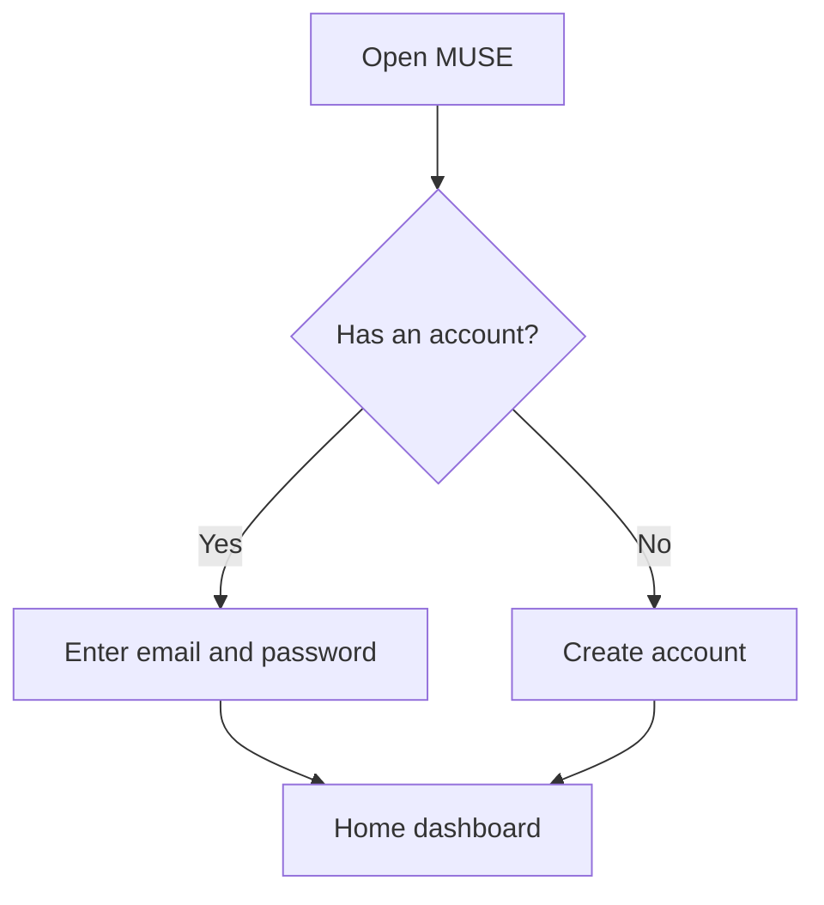
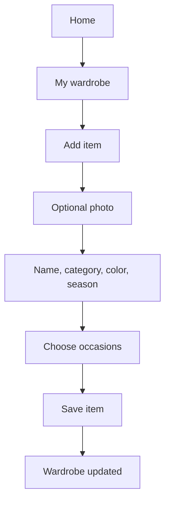
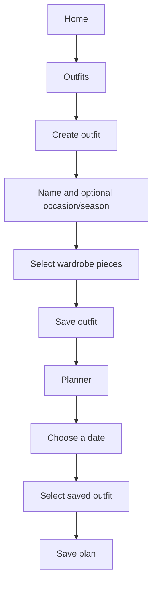
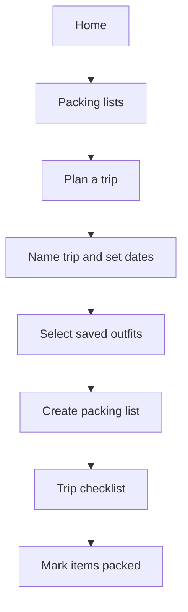
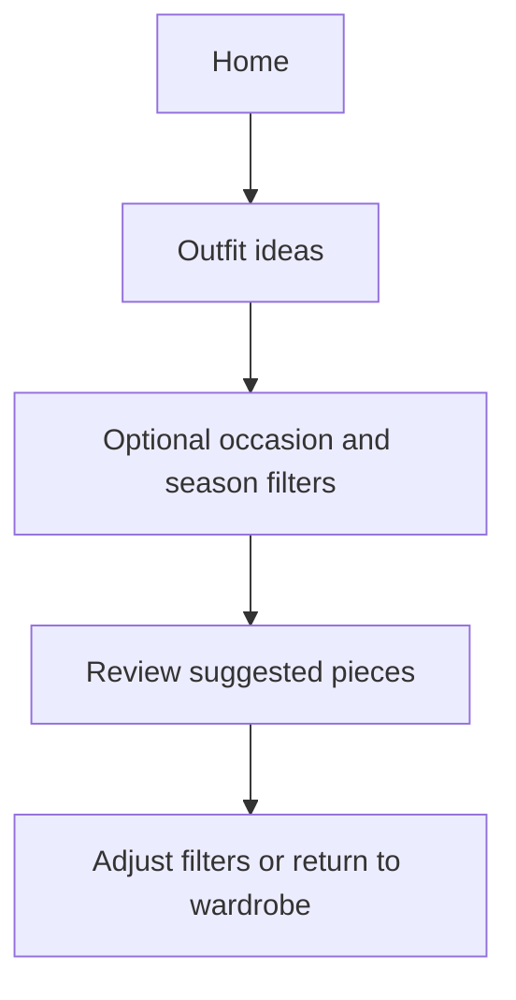

# MUSE User Flows

## Account access

```mermaid
flowchart TD
  A[Open MUSE] --> B{Has an account?}
  B -->|Yes| C[Enter email and password]
  B -->|No| D[Create account]
  C --> E[Home dashboard]
  D --> E
```

## Add a wardrobe item

```mermaid
flowchart TD
  A[Home] --> B[My wardrobe]
  B --> C[Add item]
  C --> D[Optional photo]
  D --> E[Name, category, color, season]
  E --> F[Choose occasions]
  F --> G[Save item]
  G --> H[Wardrobe updated]
```

## Create and plan an outfit

```mermaid
flowchart TD
  A[Home] --> B[Outfits]
  B --> C[Create outfit]
  C --> D[Name and optional occasion/season]
  D --> E[Select wardrobe pieces]
  E --> F[Save outfit]
  F --> G[Planner]
  G --> H[Choose a date]
  H --> I[Select saved outfit]
  I --> J[Save plan]
```

## Prepare for a trip

```mermaid
flowchart TD
  A[Home] --> B[Packing lists]
  B --> C[Plan a trip]
  C --> D[Name trip and set dates]
  D --> E[Select saved outfits]
  E --> F[Create packing list]
  F --> G[Trip checklist]
  G --> H[Mark items packed]
```

## Get an outfit idea

```mermaid
flowchart TD
  A[Home] --> B[Outfit ideas]
  B --> C[Optional occasion and season filters]
  C --> D[Review suggested pieces]
  D --> E[Adjust filters or return to wardrobe]
```
